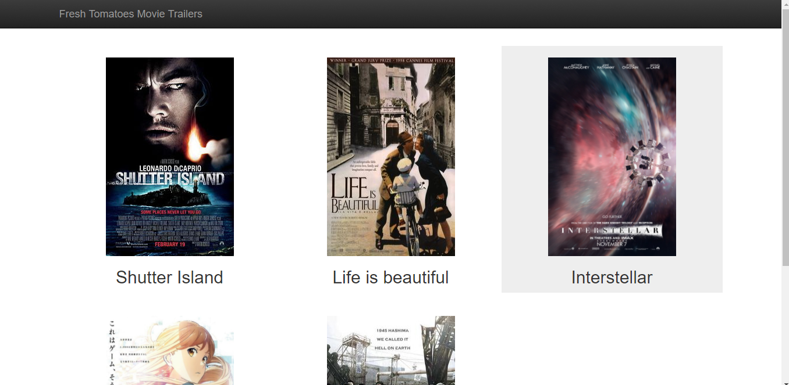

# Full Stack Web Developer Project 1 - Movie Trailer Website
This is the first project in the course "Full Stack Web Developer" from Udacity. The development is supervised by Udacity.

## Development Enviroment
This program is developed under python v2.7.14.
## How to use
This project aims to familiarize the object-oriented programming. You can invoke the python program `entertainment_center.py` to create and open an HTML file.
### Building and opening the HTML file
You can run the following command in command prompt or terminal to build the fresh_tomatoes.html.
```sh
$ python entertainment_center.py
```
Then, the program will create the HTML file and open your default browser for viewing the result.